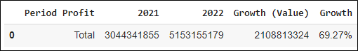

# Analyzing Data with Python
In today’s digital era, e-commerce has become a thriving industry, generating vast amounts of data that hold valuable insights for businesses. To unlock the potential of this data and gain a competitive edge, organizations are turning to Python, a powerful programming language with extensive data analysis capabilities. In this article, we will explore the fascinating world of analyzing e-commerce data with Python through a case study from an e-commerce firm. This case study is part#2 of the My Skill Data Analysis Bootcamp Case Project. From data collection and cleaning to exploratory analysis and visualization, we will delve into various techniques and tools that empower businesses to extract meaningful insights and make data-driven decisions.


## Introduction

A join meeting was held in a company, and in order to follow up the meeting, a data analyst team has been assigned to address some issues the company is  currently working on. The data analyst team utilized the python to analyse some given data and draw conclusion from it.

## Dataset
The native dataset used inthis analysis is from Kaggle – Pakistan Largest E-Commerce Dataset with several with several modification. The listed price has been converted from Rupee to Rupiahs with currency rate of 1 Rupee = IDR 58. We can find the native datasets form [Kaggle](https://www.kaggle.com/datasets/zusmani/pakistans-largest-ecommerce-dataset). The datasets consist of 4 tables:
1. The Order Detail table (order_detail.csv)
2. Payment Detail table (payment_detail.csv)
3. Customer Detail table (customer_detail.csv)
4. Stock Keeping Unit table (sku_detail.csv)

```Sh
# Importing library - 1
import pandas as pd
import numpy as np
import matplotlib.pyplot as plt
import seaborn as sns
sns.set()
from pandas.tseries.offsets import BDay

# Importing data sources to Google Colab -2
path_od = "https://raw.githubusercontent.com/dataskillsboost/myskill/main/order_detail.csv"
path_pd = "https://raw.githubusercontent.com/dataskillsboost/myskill/main/payment_detail.csv"
path_cd = "https://raw.githubusercontent.com/dataskillsboost/myskill/main/customer_detail.csv"
path_sd = "https://raw.githubusercontent.com/dataskillsboost/myskill/main/sku_detail.csv"
df_od = pd.read_csv(path_od)
df_pd = pd.read_csv(path_pd)
df_cd = pd.read_csv(path_cd)
df_sd = pd.read_csv(path_sd)
```
Exploring the Datasets:
```Sh
# Displaying the first 10 rows of the datasets -3A
df_od.head(10)
```


```Sh
# Displaying the first 10 rows of the datasets -3B
df_pd.head(10)
df_cd.head(10)
df_sd.head(10)
```


We also need to analyze the connection between the 4 tables in order to make further analysis and synthesize insights. Therefore, we need to create possible joins them.

```Sh
#Running SQL in Colab
from sqlite3 import connect

# Creating connection with sqlite
conn = connect(':memory:')

# dumping dataframe into a table in sqlite
df_od.to_sql('order_detail',conn, index=False, if_exists='replace')
df_pd.to_sql('payment_detail', conn, index=False, if_exists='replace')
df_sd.to_sql('sku_detail', conn, index=False, if_exists='replace')
df_cd.to_sql('customer_detail', conn, index=False, if_exists='replace')
df_od.to_sql
pd.read_sql('select * from sku_detail',conn)
df_sd.to_sql('sku_detail', conn, index=True, if_exists='replace')
pd.read_sql('select * from sku_detail', conn)
df_sd.to_sql('sku_detail', conn, index=False, if_exists='replace')
pd.read_sql('select * from sku_detail', conn).head()

# Joining datasets using Query SQL into a table
df = pd.read_sql("""
SELECT
    order_detail.*,
    payment_detail.payment_method,
    sku_detail.sku_name,
    sku_detail.base_price,
    sku_detail.cogs,
    sku_detail.category,
    customer_detail.registered_date
FROM order_detail
LEFT JOIN payment_detail
    on payment_detail.id = order_detail.payment_id
LEFT JOIN sku_detail
    on sku_detail.id = order_detail.sku_id
LEFT JOIN customer_detail
    on customer_detail.id = order_detail.customer_id
""",conn)
```

Displaying the first 5 rows of the joined datasets
```Sh
df.head(5)
```


## Problem and Analysis
>### Case-1
> At the end of this year, the company will give prizes to customers who win the Year-End Festival competition. The Marketing Team needs help to determine the estimated prize that will be given to the winner of the competition later. These prizes will be taken from the TOP 5 Products from the Mobiles & Tablets Category during 2022, with the highest total sales quantity (valid = 1).

```Sh
#Storing the data in Pandas Data Frame
data1 = pd.DataFrame(\
                     #Filtering data with is_valid =1                     df[(df['is_valid']==1) &\
                        #Filtering data with category of Mobiles and Tablets
                        (df['category']=='Mobiles & Tablets') &\
                        #Filtering data for transaction during 2022
                        ((df['order_date'] >= '2022-01-01') & (df['order_date'] <= '2022-12-31'))]\
                     #Grouping the data
                     .groupby(by=["sku_name"])["qty_ordered"]\
                     #Summing the the quantity order based on the corresponding sku_name
                     .sum()\
                     #Sorting the data in descending way
                     .sort_values(ascending=False)\
                     #Selecting the top 5 product with the most quantity number
                     .head(5)\
                     #resetting the header
                     .reset_index(name='qty_2022'))
data1
```


Based on the result, the TOP 5 Products from the Mobiles & Tablets Category during 2022, with the highest total  sales quantity (valid = 1) are shown above. The Marketing Team can determine the estimated prize that will be  given to the winner of the competition based on the provided solution.

>### Case-2
> Following up on the joint meeting of the Werehouse Team and Marketing Team, the Team found that there was still a lot of product stock in the Beauty & Grooming Category at the end of 2022. The Team asked for help to check the sales data for this category for 2021 in terms of sales quantity. Our provisional estimate is that there has been a decrease in sales quantity in 2022 compared to 2021. (Please also display data for the 15 categories).

```Sh
#Storing the data into Pandas DataFrame
    data2 = pd.DataFrame(\
    #Filtering Data with is_valid=1
    df[(df['is_valid']==1) &\
    #Filtering data for transaction during 2021
    ((df['order_date'] >= '2021-01-01') & (df['order_date'] <= '2021-12-31'))]\
    #grouping the data
    .groupby(by=["category"])["qty_ordered"]\
    #Summing the quantity
    .sum()\
    #Sorting the data
    .sort_values(ascending=False)\
    #Resetting header
    .reset_index(name='qty_2021'))
data2

#Storing data into Pandas DataFrame
    data3 = pd.DataFrame(\
    #Filtering Data with is_valid=1
    df[(df['is_valid']==1) &\
    #Filtering data for transaction during 2022
    ((df['order_date'] >= '2022-01-01') & (df['order_date'] <= '2022-12-31'))]\
    #grouping data
    .groupby(by=["category"])["qty_ordered"]\
    #summing the data
    .sum()\
    #Sorting the data
    .sort_values(ascending=False)\
    #Resetting header
    .reset_index(name='qty_2022'))
data3

data4 = pd.merge(data2,
    data3,
    left_on='category',
    right_on='category’)
    data4
    #Growth = Last Year – Previous Year
    data4['qty_growth'] = data4['qty_2022'] - data4['qty_2021']
data4
```


The above syntax results the data of 15 Product categories in which some of them experienced decrement in Sales Quantity, while others experienced the other direction. Based on the result, Soghaat experienced the biggest decrement (most negative growth) with -5032 Sales Quantity, while the Superstore experienced the biggest increment (most positive growth) with 22631 Sales Quantity.

>### Case-3
> If there is indeed a decrease in the quantity of sales in the Beauty & Grooming category, the Team asked for assistance in providing data on the TOP 20 product names that have experienced the highest decline in 2022 when compared to 2021. We will use this as material for discussion at the next meeting.

```Sh
data5 = pd.DataFrame(\
    df[(df['is_valid']==1) &\
    (df['category']=='Beauty & Grooming') &\
    ((df['order_date'] >= '2021-01-01') & (df['order_date'] <= '2021-12-31'))]\
    groupby(by=["sku_name"])["qty_ordered"]\
    sum()\
    sort_values(ascending=False)\
    reset_index(name='qty_bg_2021'))
data5
data6 = pd.DataFrame(\
    df[(df['is_valid']==1) &\
    (df['category']=='Beauty & Grooming') &\
    ((df['order_date'] >= '2022-01-01') & (df['order_date'] <= '2022-12-31'))]\
    groupby(by=["sku_name"])["qty_ordered"]\
    sum()\
    sort_values(ascending=False)\
    reset_index(name='qty_bg_2022'))
data6
data7 = data5.merge(data6, left_on = 'sku_name', right_on = 'sku_name')
    data7['qty_bg_growth']=data7['qty_bg_2022']- data7['qty_bg_2021']
    data7.sort_values(by=['qty_bg_growth'],ascending=True, inplace=True)
    data7 = data7.head(20)
data7
```


The above solution results the data of 20 Product name based on Category of Beauty and Grooming. All of products in the category experienced decrement in Sales Quantity. Based on the result, kcc_krone deal experienced the biggest decrement with -1135 Sales Quantity, followed by kcc_glamour deal with -360, and kcc_Buy 2 Frey Air Freshener* with -266 in the third place. The others are depicted in the table.

>### Case–4
>Regarding the company's anniversary in the next 2 months, the Digital Marketing Team will provide promo information for customers at the end of this month. The customers that will meet our criteria are those who have checked out but have not made a payment during 2022. The required data is the Customer ID and Registered Date. Providing the corresponding data would be a great assistance to the Digital Marketing Team

```Sh
data8 = df[\
    (df['is_gross']==1) &\
    (df['is_valid']==0) &\
    (df['is_net']==0) &\
    ((df['order_date'] >= '2022-01-01') & (df['order_date'] <= '2022-12-31’))]
data9 = data8[['customer_id','registered_date']].drop_duplicates()
    from google.colab import files
    data9.to_csv('audience_list.csv', encoding = 'utf-8-sig',index=False)
    files.download('audience_list.csv')
```
The above solution create a file name audience_list.csv.

>### Case–5
> An Annual Report will submitted to Investors in the following month. Related to that, the management and C-Leveles need to provided the Overall Profit Growth (%) 2021 vs 2022 as result of annual sales performance.

```Sh
#Calculating profit
    df['profit'] = df['after_discount'] - df['cogs’]
    #Storing data into Pandas DataFrame
    data10 = df[\
    (df['is_valid']==1) &\
    ((df['order_date'] >= '2022-01-01') & (df['order_date'] <= '2022-12-31'))]
    #Storing data into Pandas DataFrame
    data11 = df[\
    (df['is_valid']==1) &\
    ((df['order_date'] >= '2021-01-01') & (df['order_date'] <= '2021-12-31'))]
    #Creating Dataframe and Summary
    data12 = {\
    'Period Profit':'Total',\
    '2021': data11['profit'].sum(), \
    '2022': data10['profit'].sum(),\
    'Growth (Value)': data10['profit'].sum() - data11['profit'].sum(),\
    'Growth': pd.Series(round(((data10['profit'].sum() - data11['profit'].sum())/data11['profit'].sum())*100,2), dtype=str)+'%'
    }
pd.DataFrame(data=data12, index=[0]
```



Based on the result, the company managed to yield around 5.15 Billion of profit in 2022 indicating a significant growth of around 2.1 Billion when compared to the previous year with 3.04 Billion. This equivalent of 69.27% growth YoY

>### Case–6
> An Annual Report will submitted to Investors in the following month. The Management and C-Levels need also to provided the Profit Growth (%) by Product Category in 2021 vs 2022.

```Sh
#Using Groupby to do Summing
data13 = pd.DataFrame(data10\
    .groupby(by="category")["profit"].sum()\
    .sort_values(ascending=False)\
    .reset_index(name='profit_2022'))
data13
data14 = pd.DataFrame(data11\
    .groupby(by="category")["profit"].sum()\
    .sort_values(ascending=False)\
    .reset_index(name='profit_2021'))
data14
#Combining data
data15 = data14.merge(data13, left_on = 'category', right_on = 'category')
data15
#Melakukan kalkulasi
data15['Growth (Value)'] = data15['profit_2022']-data15['profit_2021']
    data15['Growth (%)'] = round(data15['Growth (Value)']/data15['profit_2021']*100,2)
    data15.sort_values(by=['Growth (%)'], ascending = False, inplace = True)
data15
```
The above solution produced the following result:


The table compare the profit between 2021 and 2022, the profit  difference or (growth) value, as well as the Percentage of growth.

```Sh
data15.plot(x='category',
    y=['Growth (%)'],
    kind='bar',
    grid = True,
    title = 'Growth 2021 vs 2022',
    xlabel = 'Category',
    ylabel = 'Growth (%)',
    figsize=(12,7),
    rot = 90,
    table = False,
    sort_columns = False,
    secondary_y = False)
```

Plotting the table into chart, we can better compare the profit among the categories


Based on the result, there are 15 product categories shown in the chart. There are 11 of them experienced positive growth with Superstore providing the highest percentage of growth 346.2 % that equals to almost 175 Millions profit. On the contrary, Books category providing the lowest growth of -50.76% that equals to 4.2 Millions lost.

>### Case–7
> From October to December 2022, The Campaign Team has been running a campaign every Saturday and Sunday. They want to assess whether the campaign has enough impact on increasing sales (before_discount). Please help to display data: Average daily weekend sales (Saturday and Sunday) vs. average daily sales weekdays (Monday-Friday) per month. Is there an increase in sales in each of these months?

```Sh
data16 = pd.DataFrame(df[(df['is_valid']==1) \
    & (df['day'].isin(['Saturday','Sunday']))\
    & (df['order_date'] >= '2022-01-01') & (df['order_date'] <= '2022-12-31')]\
    .groupby(by=["month_num","month"])["before_discount"].mean()\
    .round()\
    .sort_values(ascending=False)\
    .reset_index(name='avg_profit_weekend’))
data16
data17 = pd.DataFrame(df[(df['is_valid']==1) \
    & (df['day'].isin(['Monday','Tuesday','Wednesday','Thusday','Friday']))\
    & (df['order_date'] >= '2022-01-01') & (df['order_date'] <= '2022-12-31')]\
    .groupby(by=["month_num","month"])["before_discount"].mean()\
    .sort_values(ascending=False)\
    .round()\
    .reset_index(name='avg_profit_weekdays'))
data17
data18 = data16.merge(data17, left_on = 'month', right_on = 'month')
    data18.sort_values(by='month_num_x',ascending=True, inplace=True)
    data18 = data18[["month","avg_profit_weekend","avg_profit_weekdays"]]
data18
```
The solution provides the output:


Plotting the above result into a chart, will provide us a better sight of the monthly comparison.

```Sh
data18.plot(x='month',
    y=['avg_profit_weekend','avg_profit_weekdays'],  kind='bar', grid = True,
    xlabel = 'Category',  ylabel = 'Total',  figsize=(12,7),
    rot = 90,  table = False,
    secondary_y = False)
```


>### Case–8
> Given the same condition above, please provide Average daily sales weekends (Saturday and Sunday) vs. average daily sales weekdays (Monday-Friday) for the entire 3 months.

```Sh
#Storing data into Pandas DataFrame
data19 = df[\
    #Filtering data with paid transaction (is_valid=1) on weekend
    (df['is_valid']==1) &\
    (df['day'].isin(['Saturday','Sunday'])) &\
    #Filtering data for transaction during 2022
    ((df['order_date'] >= '2022-10-01') & (df['order_date'] <= '2022-12-31'))]
#Storing data into Pandas DataFrame
data20 = df[\
    #Filtering data with paid transaction (is_valid=1) on weekdays
    (df['is_valid']==1) &\
    (df['day'].isin(['Monday','Tuesday','Wednesday','Thusday','Friday'])) &\
    #Filtering data for transaction during 2022
    ((df['order_date'] >= '2022-10-01') & (df['order_date'] <= '2022-12-31'))]
data21 = {\
    'Periode':'Total 3 months',\
    'Avg Weekend Sales': round(data19['before_discount'].mean(),2), \
    'Avg Weekdays Sales': round(data20['before_discount'].mean(),2),\
    'Diff (Value)': round(data19['profit'].mean() - data20['profit'].mean(),2),\
    'Diff (%)': pd.Series(round(((data19['profit'].mean() - data20['profit'].mean())/data19['profit'].mean())*100,2), 
dtype=str)+'%'
    }
pd.DataFrame(data=data21, index=[0])
```
The above solution provides the following output:


Based on the comparison, there is no significant impact from the weekend campaign. On the contrary, the sales in weekend tend to decrease around 2.26%. We need to change or improve the weekend campaign.

>### Case-9
> In order to understand a customer's purchasing power, the data of AOV (Average Order Value or Total sales / Total Order) every month during 2021 vs 2022 is required.

```Sh
data22 = pd.DataFrame(df[(df['is_valid']==1) & ((df['order_date'] >= '2022-01-01') & (df['order_date'] <= '2022-12-31'))]\
    .groupby(by=['month_num','month'])["after_discount"].sum()\
    .round()\
    .reset_index(name='sales_2022'))\
    .sort_values(by=['month_num'],ascending=True)\
    .head(12)
data23 = pd.DataFrame(df[(df['is_valid']==1) & ((df['order_date'] >= '2022-01-01') & (df['order_date'] <= '2022-12-31'))]\
    .groupby(by=['month_num','month'])["id"].nunique()\
    .round()\
    .reset_index(name='order_2022'))\
    .sort_values(by=['month_num'],ascending=True)\
    .head(12)
data24 = pd.DataFrame(df[(df['is_valid']==1) & ((df['order_date'] >= '2021-01-01') & (df['order_date'] <= '2021-12-31'))]\
    .groupby(by=['month_num','month'])["after_discount"].sum()\
    .round()\
    .reset_index(name='sales_2021'))\
    .sort_values(by=['month_num'],ascending=True)\
    .head(12)
data25 = pd.DataFrame(df[(df['is_valid']==1) & ((df['order_date'] >= '2021-01-01') & (df['order_date'] <= '2021-12-31'))]\
    .groupby(by=['month_num','month'])["id"].nunique()\
    .round()\
    .reset_index(name='order_2021'))\
    .sort_values(by=['month_num'],ascending=True)\
    .head(12)
from sqlite3 import connect
    conn = connect(':memory:')
    data22.to_sql('sales_2022', conn, index=False, if_exists='replace')
    data23.to_sql('order_2022', conn, index=False, if_exists='replace')
    data24.to_sql('sales_2021', conn, index=False, if_exists='replace')
    data25.to_sql('order_2021', conn, index=False, if_exists='replace')
    data26 = pd.read_sql("""
SELECT
    sales_2021.*,
    order_2021.order_2021,
    sales_2022.sales_2022,
    order_2022.order_2022
FROM sales_2022
LEFT JOIN order_2022
    on order_2022.month_num = sales_2022.month_num
LEFT JOIN sales_2021
    on sales_2021.month_num = sales_2022.month_num
LEFT JOIN order_2021
    on order_2021.month_num = sales_2022.month_num
""", conn)
data26['AOV 2021'] = round(data26['sales_2021']/data26['order_2021'],2)
data26['AOV 2022'] = round(data26['sales_2022']/data26['order_2022'],2)
data26['Diff AOV (value)']= data26['AOV 2022']-data26['AOV 2021']
data26['Diff AOV (%)'] = round((data26['AOV 2022']-data26['AOV 2021'])/data26['AOV 2021']*100,2)
data26.plot(x='month',
    y=['AOV 2021','AOV 2022'],
    kind='bar',
    grid = True,
    xlabel = 'Month',
    ylabel = 'AOV',
    figsize=(12,7),
    rot = 35,
    table = False,
    secondary_y = False)
```
The above solution provides monthly data AOV (in table and Chart) during the year 2021 & 2022:


>### Case-10
>In order to understand a customer's purchasing power, the data of total annual AOV 2021 vs 2022 is required.
>
```Sh
data26.columns
    aov_2021 = round(data26['sales_2021'].sum()/data26['order_2021'].sum(),2)
    aov_2022 = round(data26['sales_2022'].sum()/data26['order_2022'].sum(),2)
data27 = {\
    'Periode':'Total',\
    'AOV 2021': aov_2021, \
    'AOV 2022': aov_2022, \
    'Growth (value)': aov_2022-aov_2021,\
    'Growth': pd.Series(round((aov_2022-aov_2021)/aov_2021*100,2), dtype=str)+'%'
    }
pd.DataFrame(data=data27, index=[0])
```

The above solution provides the following result:


## Conlusion
In conclusion, based on Cases provided ( Case 1 to Case 10), we can utilize Python not only to display numbers but also to find insights that can be useful in order to address any related issue. Python enables data analyst to conduct calculation and analysis that involves complex mathematical and query method. As well as displaying charts or visuals. This analytical tool is useful to provide a better understanding of the on-going firm’s performance, as well as to craft a better data-driven strategy

## Referrences
1. Python 3.11.4 Documentation: https://docs.python.org/3/
2. Full stack Intensive Bootcamp for Data Analyst by MySkill.id (Python Part 1 to 3)
3. https://www.kaggle.com/datasets/zusmani/pakistans-largest-ecommerce-dataset

## Acknowledgement
[Azka Nur Afifah](https://www.linkedin.com/in/azkanuraf/), [Wijaya Putra](https://www.linkedin.com/in/wijaya-putra-0780a3135/), [Achmad Nafila Rozie](https://www.linkedin.com/in/achmadrozie/), [Rizky Teguh Kurniawan](https://www.linkedin.com/in/rizkitk/), and team from [My Skill.id](https://myskill.id).
 
